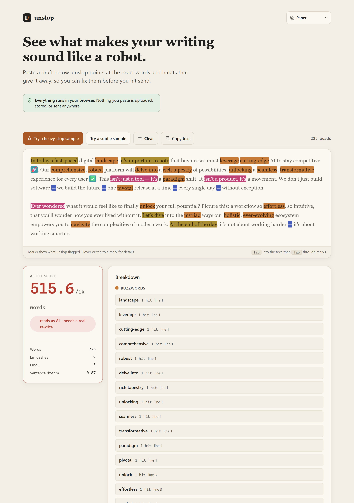

# noslop

**The only deterministic AI-writing linter that speaks 16 languages: English, Spanish, French, German, Portuguese (Brazil), Italian, Dutch, Russian, Ukrainian, Polish, Czech, Turkish, Swedish, Romanian, Hungarian, and Finnish. No model, no upload - it reads the text on your machine and prints the exact phrase to fix. Since 0.10.0 it reads source code too: point it at a `.py`/`.js`/`.go`/`.rs` file and it shows you, line by line, what makes the code read AI-written.**

[](https://github.com/munzzyy/noslop/actions/workflows/test.yml)
[](LICENSE)


[](https://munzzyy.github.io/noslop/)

Every other AI-writing detector on the market runs a machine-learning model on someone
else's server: you upload a draft, wait, and get back a percentage with no way to check
its work. noslop runs no model at all. It's word lists, regex, and rhythm math, all in
one file you can read end to end, scoring your text on your own machine. Paste the same
paragraph in twice, a year apart, and the score doesn't move, because there's no model
behind it to retrain.

> **The proof is the product: this README scores 0.0/1k on noslop itself, noslop.py scores 0.0/100 in its own code mode, and CI fails the build the day either stops being true.**

Four ways to run it: paste into the [browser app](https://munzzyy.github.io/noslop/), drop the CLI into a pre-commit hook or CI, wire it into [reviewdog](#hooks) for inline PR comments, or install it as a skill so your AI coding agent checks its own prose before handing it back to you.

**[Try it in your browser](https://munzzyy.github.io/noslop/).** Paste a draft and watch the tells light up. It all runs client-side, so nothing you paste is uploaded, stored, or sent anywhere.

[](https://munzzyy.github.io/noslop/)

Prefer the terminal? It's also one Python file with no dependencies that drops into a pre-commit hook or CI. Same scoring engine either way, and either way it runs locally and deterministically with no network access.

## Why this and not a detector

| | noslop | Cloud AI detectors (GPTZero, Copyleaks, Originality.ai, Pangram, Winston...) | vale-ai-tells |
|---|---|---|---|
| How it decides | fixed word lists, regex, and rhythm math, all in [noslop.py](noslop.py) | a trained classifier; weights and training data aren't published | fixed word lists and regex (Vale rules) |
| Same input, twice | same score, always | can shift after a silent model update | same score, always |
| Your draft leaves your machine | never | yes, that's how the check runs | never |
| Tells you which phrase to fix | yes, with a line number and a hint | no, just a percentage | yes, with a line number |
| Sentence-rhythm / paragraph checks | yes | not published, so unknown | no - its own docs say it ["can't detect sentence-length uniformity, or burstiness [or] paragraph-length patterns"](#vs-vale--vale-ai-tells) |
| Languages | 16, each researched separately, same weights everywhere | English is strongest; Copyleaks, Originality.ai, and Pangram each cover 20-30+ as one shared model, not per-language research | English only |
| Cost | free, no account | paid API or credit-based | free, needs a Vale install |

Nothing else combines that column. The honest limits are documented [below](#limitations) - a
clean score means these tells are absent, not that a human typed it. That's the linter's contract:
catch what's catchable, show the work, leave the verdict-guessing to tools that enjoy being wrong.

## Why deterministic beats a black box

A cloud detector's score depends on a model you can't see, retrained on a schedule nobody
publishes. The same essay can score 12% one month and 61% the next after a silent update,
and the vendor's dashboard will insist both numbers were right. When that score is the
reason a student gets accused of cheating or a freelancer gets turned down for a job,
trusting the model isn't good enough, and there's nothing to appeal to but the vendor's
word.

noslop can't drift that way, because there's nothing behind it to update. The word lists,
the regex, and the arithmetic all sit in [noslop.py](noslop.py), readable end to end in an
afternoon. Paste the same draft in twice and you get the same score twice, on any machine,
forever. If the score looks wrong, you can see the exact line and rule that fired and argue
with the rule itself instead of a percentage nobody can explain.

## As an agent skill

Point your coding agent at noslop and it'll lint its own writing before handing a PR description, commit message, or doc back to you. Two install paths, pick whichever your agent supports:

```bash
# Claude Code
/plugin marketplace add munzzyy/noslop
/plugin install noslop@noslop

# any agent using the open Agent Skills standard (Codex, Cursor, and others)
npx skills add munzzyy/noslop
```

Either way, the agent gets [SKILL.md](skills/noslop/SKILL.md): what to run, how to read the score, and the rule that it flags but never rewrites - the rewrite stays the agent's job, same as it's always been yours. Ask the agent something like "check this PR description for AI tells before you post it" and it'll run `noslop.py --json` on the draft and act on what comes back.

## In your browser

[munzzyy.github.io/noslop](https://munzzyy.github.io/noslop/) is the whole tool as a single page. Paste or type, and every buzzword, filler phrase, construction, stray em dash, and emoji gets underlined in place, with a live score and a breakdown of exactly what tripped it. No build step, no account, no server: the page loads the same scorer the CLI uses and runs it on your machine. Once loaded, it makes no further network requests - cut the connection and it keeps working.

Nine themes from the header - Paper and Ink, plus Terminal, Sepia, Newsprint, Midnight, both Solarized variants, and a high-contrast mode. Auto follows your system by default; your pick is remembered and applied before the page paints.

[](https://munzzyy.github.io/noslop/)

> Looking for a package literally named `noslop` on PyPI or npm? Those are different projects - an LLM-based rewriter and an old code-quality tool. This one ships on PyPI as `noslop-lint`; see [Install](#install).

## Example

```
$ noslop pr.txt
words: 41   AI-tell score: 658.5/1k   -> reads as AI - needs a real rewrite

LLM buzzwords:
   1x  delves             (lines 1)
   1x  seamlessly         (lines 1)
   1x  streamline         (lines 1)
   1x  robust             (lines 2)
   1x  comprehensive      (lines 3)

Filler phrases:
   1x  "it's important to note" (lines 2)
   1x  "not just a" (lines 2)
   1x  "i hope this helps" (lines 3)

Constructions:
   1x  'not just X but Y' construction (lines 2)
        -> state it plainly instead of the contrast frame
$ echo $?
1
```

## Example, in Spanish

```
$ noslop informe.md
words: 29   AI-tell score: 517.2/1k   -> reads as AI - needs a real rewrite
language: Español (detected)

LLM buzzwords:
   1x  robusta            (lines 1)
   1x  vanguardia         (lines 1)

Filler phrases:
   1x  "es importante destacar" (lines 1)
   1x  "cuando se trata de" (lines 2)

Constructions:
   1x  construcción 'no solo X, sino Y' (lines 2)
        -> dilo directamente, sin el marco de contraste
```

No `--lang` flag. The auto-detector recognized Spanish from stop-word coverage in the
first few thousand characters and switched to the Spanish word lists, patterns, and
em-dash allowance on its own - the same thing it does for the other fifteen packs.

## Sixteen languages

An LLM writing Spanish slop doesn't use translations of the English tells - it has its
own crutches (*sumérgete*, *sin fisuras*, *cabe destacar*), and German slop leans on
*nahtlos* and *es ist wichtig zu beachten*. So every language here carries its own
researched lists, not a machine translation of the English ones: English, Spanish,
French, German, Portuguese (Brazil), Italian, Dutch, Russian, Ukrainian, Polish, Czech,
Turkish, Swedish, Romanian, Hungarian, and Finnish.

The input language is sniffed per file from stop-word coverage (standard library only,
nothing phones home) and every pack keeps the same weights, so a 25+/1k verdict means
the same thing in every language. Punctuation habits that differ by language are tuned
per pack - Spanish dialogue dashes don't get flagged as em-dash spray. Force a language
with `--lang` when you know better:

```bash
noslop --lang de entwurf.md
noslop informe.md            # auto-detected per file
```

Text the sniffer can't confidently place falls back to the English lists plus the
structural checks (rhythm, formatting, emoji), and the output says so instead of
pretending - `--json` carries `language` and `language_source`
(`detected` / `forced` / `fallback`).

Some languages are deliberately absent rather than badly present. Danish and Norwegian
Bokmål share too many function words to tell apart by this method, Greek's candidate
list ran into words that are ordinary prose there, and a few others would have been
guesses. Chinese, Japanese, and Korean need different tokenization entirely, so they
aren't faked with the current pipeline. A pack only ships when the tells are real.

The browser app follows along: its interface reads in 32 languages (pick from the globe
menu), it shows which language it detected in your text, and you can override that per
paste.

## Code mode: was this code written by an AI?

Give noslop a source file and it stops scoring prose and starts scoring code. Any
of the usual extensions flips the mode automatically - Python, JavaScript,
TypeScript, Go, Rust, Java, C, C++, C#, Ruby, shell, SQL, and a few dozen more -
or force it with `--code` (stdin, odd extensions) and back with `--prose`.

```
$ noslop generated.py
lines: 72 (25 code, 12 comment)   AI-tell score: 153.3/100 lines   -> reads as AI-written code
language: Python

Explainer-voice comments (written for the requester, not the maintainer):
   2x  "example usage" (lines 4, 65)
   1x  "import the necessary" (lines 8)
   1x  "replace with your" (lines 67)
   1x  "you can customize" (lines 71)

Comment constructions:
   3x  narrated step comments (Step 1 / Step 2 / ...) (lines 55, 57, 59)
        -> comments that walk a reader through steps are chat narration - document why, not what

Code habits:
  - 2 stock error message(s) ('An error occurred...') (lines 25, 34)
  - 1 catch-and-print handler(s) that swallow the error (lines 33)
  - 2 comment(s) that restate the code they sit on (lines 57, 59)
  - 1 docstring(s) that just restate the function name (lines 39)
```

Same contract as prose mode: no model, nothing leaves your machine, and every
point on the score is a finding with a line number you can argue with. The file
is first split into comments, docstrings, string literals, and code - by a real
string-aware scanner, so a `//` inside a URL string never counts as a comment -
and each check looks only where its evidence lives:

- **chat residue in comments** - `Co-Authored-By: Claude` trailers,
  `Generated with [Claude Code]` footers, Cursor/Devin trailers, links to
  `claude.ai/share` or `chatgpt.com/share`, chatbot disclaimers, markdown
  fences pasted into a comment, and truncation markers
  (`# ... rest of the code remains the same`).
  Nobody types these into a working file, so one hit scores the hard verdict,
  same as prose artifacts. Absence proves nothing - these are the first thing
  people strip.
- **explainer-voice comments** - written for the requester instead of the next
  maintainer: `Example usage`, `In a real application, you would...`, `You can
  customize this as needed`, `Import the necessary libraries`, placeholder
  paths like `path/to/your/...`.
- **narrated walkthroughs** - `Step 1:` comments, `First, we...` / `Finally,
  we...`, and body comments that open on a narration verb (Create/Check/
  Iterate...). That last one is density-gated AND needs corroboration from
  another finding class before it scores a point, because imperative comments
  are also an old human habit - 2012-era jQuery in the eval corpus narrates
  exactly this way and scores 0.0.
- **comments that restate the code** - `# increment the counter` above
  `counter += 1`, measured by how much of the comment's vocabulary is already
  in the next line's identifiers. Docstrings that just restate the function
  name (`def get_user_name` -> `"""Get the user name."""`) count the same way.
- **the assistant's error handling** - `print(f"An error occurred: {e}")`,
  `console.error` inside a catch that decides nothing, and the
  `...successfully` victory-lap log line.
- **typography and decoration** - em dashes, curly quotes, arrows, and
  ellipsis characters in comments (editors type `--`, `->`, `...`; the
  typographic forms arrive by paste), emoji in comments and log strings, and
  invisible Unicode outside string literals (artifact tier - paste evidence at
  best, prompt-injection surface at worst).
- **the prose engine, on your comments** - the same 16-language buzzword and
  filler-phrase lists run over comment and docstring text, so `robust` and
  `it's important to note` cost the same there as in a README.

Mention isn't use: a comment that *quotes* a tell in `"double quotes"` or
`` `backticks` `` is talking about the phrase, not writing in it, and is
excused - which is how noslop.py itself scores 0.0/100 in its own code mode
with the test suite holding it there. String literals are treated as data, not
style, so i18n catalogs and test fixtures don't count against you.

Comment density, banner comments, 100% docstring coverage, uniform line
lengths, and generic `result`/`data`/`temp` naming are reported as diagnostics
but never scored - tutorial code, auto-formatters, and disciplined humans all
produce those, and the research behind this mode says they can't carry an
accusation on their own.

Measured like prose mode: on the labeled code corpus in `eval/` the current
engine has an AUC of **0.9643**, catches **92.9%** of the AI samples at the
soft threshold (85.7% at the hard one), and flags **zero** of the fifteen
human samples - with the
corpus deliberately stacked with the human code most likely to false-positive
(lodash's JSDoc-on-everything, kilo.c's teaching comments, TensorFlow's
Args:/Returns: docstrings, Vue's non-native-English comments). CI enforces
floors on all of it. The honest limits: a terse, agentic-CLI-style sample in
the corpus scores 0.0 and is expected to - the published research is clear
that surface tells can't reliably catch that register, and that human-edited
AI code caps every detector, machine-learning ones included, near a 33% recall
ceiling. A clean code score means none of these tells showed up. It does not
mean a human wrote the file.

```bash
noslop src/*.py                   # code mode by extension
noslop --code - < diff.txt        # force code mode for stdin
noslop --prose weird_readme.py    # force prose mode the other way
noslop --rdjson src/*.py | reviewdog -f=rdjsonl -name=noslop -reporter=github-pr-review
```

## Install

From PyPI (the command it installs is `noslop`):

```bash
pip install noslop-lint
```

Or with pipx, straight from the repo:

```bash
pipx install git+https://github.com/munzzyy/noslop
```

Or skip the install entirely, since it's a single file with no dependencies:

```bash
curl -LO https://raw.githubusercontent.com/munzzyy/noslop/main/noslop.py
python noslop.py --help
```

## Usage

```bash
noslop draft.md                     # one file
noslop docs/*.md                    # several files
git log -1 --format=%B | noslop     # or stdin
noslop --quiet draft.md             # verdict line only
noslop --json draft.md              # results as JSON
noslop --exclude CHANGELOG.md docs/*.md   # skip a file in a glob run
noslop --lang es informe.md         # force a language pack (default: auto-detect)
```

The exit code is 0 when every input scores under the threshold, 1 when something scores over it, and 2 if a path couldn't be read at all - so a crash and a lint finding never look the same to a script. The default threshold is 10; change it with `--threshold`. `docs/*.md` works even on Windows shells that don't expand the glob themselves.

In markdown files, fenced code blocks and inline code are not scored, since code samples aren't prose. Pass `--markdown` to get the same treatment for stdin or other file extensions.

To skip files in a glob run without listing them all on the command line, put a `.noslopignore` in the directory you run noslop from (one glob per line, `#` comments allowed) or repeat `--exclude PATTERN`. It's read from the working directory only - noslop doesn't search parent directories for it the way it does for `.noslop.json`.

## Config

Editing `noslop.py` directly to change the word lists works, but it doesn't survive a `pipx` upgrade. For anything that needs to persist, drop a `.noslop.json` in your repo root (noslop walks up from the current directory looking for one, stopping at the first `.git` it finds):

```json
{
  "ignore_words": ["robust", "leverage"],
  "ignore_phrases": ["at the end of the day"],
  "extra_words": ["synergize"],
  "extra_phrases": ["circle back"],
  "extra_patterns": [
    {"label": "company jargon", "regex": "\\bsynergize\\b", "weight": 3, "hint": "say what you mean"}
  ]
}
```

`ignore_words` / `ignore_phrases` remove entries from the built-in lists, `extra_words` / `extra_phrases` add your own on top. `extra_patterns` adds custom regexes alongside the built-in constructions (the "not just X but Y" frame, hedge stacks, and the rest): each entry needs a `regex`, plus an optional `label`, `weight` (default 1), and `hint`. A regex that doesn't compile is reported as `noslop: <path>: ...`, not a traceback. All keys are optional. Use `--config PATH` to point at a specific file instead of relying on the directory walk, or `--no-config` to ignore any config file for one run.

## Hooks

As a plain git hook:

```bash
# .git/hooks/commit-msg
noslop --quiet "$1" || echo "that commit message reads a bit AI"
```

Written like that it only warns. Drop the `|| echo` part if you want it to actually reject the commit.

With [pre-commit](https://pre-commit.com):

```yaml
repos:
  - repo: https://github.com/munzzyy/noslop
    rev: v0.10.0
    hooks:
      - id: noslop
```

That runs on the markdown, text, and rst files in each commit.

As a GitHub Action, no pre-commit framework required:

```yaml
- uses: munzzyy/noslop@v0.10.0
  with:
    paths: "docs/*.md README.md"
```

For inline PR review comments instead of a plain CI log, pipe `--rdjson` output into [reviewdog](https://github.com/reviewdog/reviewdog):

```bash
python noslop.py --rdjson docs/*.md | reviewdog -f=rdjsonl -name=noslop -reporter=github-pr-review
```

`--rdjson` prints one JSON object per finding (message, file, line, severity) instead of the normal report, and pairs with `--exclude`/`.noslopignore` the same way `--json` does.

## What it checks

The word and phrase lists live at the top of [noslop.py](noslop.py); edit them directly if you're hacking on noslop itself, or use a [config file](#config) if you just want to adjust the lists for your own project. Roughly:

- **chat-UI residue** - leftover citation markup (`oaicite`, `oai_citation`, `grok_card`),
  `utm_source=chatgpt.com` links, and chatbot self-reference/disclaimer sentences
  (`As an AI...`, `As of my last update...`, `I don't have real-time access...`). Nobody
  types these by hand, so one hit scores the hard verdict on its own. (Writing *about*
  these markers trips it too - quote them in code formatting, or skip the file with
  `.noslopignore`.)
- words LLMs lean on far more than people do (`delve`, `robust`, `leverage`, `tapestry` -
  plus the words two 2025 word-frequency studies measured at 3x-67x their pre-LLM baseline:
  `groundbreaking`, `surpassing`, `garnered`, `emphasizing`, and friends)
- boilerplate phrases (`it's important to note`, `let's dive into`, `I hope this helps`) and
  significance inflation (`stands as a testament`, `continues to captivate`, `a pivotal moment`)
- the `not just X, but Y` contrast frame, the `it isn't X, it's Y` flip, and its split-sentence
  cousin: `The problem isn't X. It's Y.`
- the dangling `-ing` significance closer (`..., highlighting the importance of...`)
- rhetorical-question openers, mid-sentence question hooks (`The result? ...`), and
  ta-da openers (`Here's why...`)
- sycophantic chat openers (`Great question!`) that leaked into prose
- anaphora triads (`where X, where Y, where Z`) - the second one on, a single triad is
  just rhetoric
- sentence-initial connective spray (`Moreover... Furthermore... Additionally...`),
  scored on density, never on one hit
- copula-avoidance filler (`serves as a`, `stands as a`, `functions as a`) once it's
  dense enough to be a habit, and scope-inflation phrases (`cannot be overstated`)
- generic listicle headings (`Introduction`, `Key Takeaways`, `Final Thoughts`) once
  two or more show up in the same document, and bare bullet glyphs (•/▪/‣) opening a
  line - chat-UI paste residue that nobody hand-types into a markdown file
- cross-paragraph opener repetition, when the same five-word opener starts three or
  more paragraphs in one document
- a punctuation-variety check, when a document leans on almost none of the normal
  range of sentence punctuation
- em dashes well past normal density, emoji in prose, and emoji decorating headings
- runs of `**Term:** explanation` bullets (with or without the bullet), bold-emphasis
  spray inside running prose
- curly and straight quotes mixed in one document - usually a paste boundary
- staccato runs of three-plus tiny sentences, sentence lengths with almost no variation,
  paragraph lengths with almost no variation
- report-only diagnostics that never move the score: heading levels that skip a level
  (H2 straight to H4), a 200-word windowed type-token ratio, and function-word ratio -
  left unscored on purpose, since both can over-flag non-native writers the same way
  the sentence-rhythm check can (see [Limitations](#limitations))
- all of the above that's language-independent runs for every language; the vocabulary,
  phrase, and construction lists are researched per language, never machine-translated.
  Russian also gets three researched additions of its own: an opener cliché
  (`в эпоху цифровизации`), a set of bureaucratic determiner/nominalization buzzwords
  (`данный`, `указанный`, `осуществление`), and a density check on `является` used as
  a formal-register crutch verb - calibrated against a real Russian legal text in
  `eval/corpus/` so it doesn't fire on ordinary formal Russian

Each hit has a weight, the weights are summed, and the total is scaled per 1,000 words. Under 10 usually reads fine. From 10 to 25 the text deserves a second pass, and past 25 it needs rewriting rather than word swaps. The cutoffs are judgment calls, not measurements; if they fight your material, move `--threshold`.

The `--json` field names (`words`, `score_per_1k`, `verdict`, `language`, `language_source`, `buzzwords`, `phrases`, `patterns`, and the rest) are treated as a stable interface once something depends on them - a pinned test in the suite locks the key set, so a rename shows up as a broken test rather than a silent break in whatever's parsing the output.

## vs. Vale / vale-ai-tells

If you're already running [Vale](https://vale.sh), [vale-ai-tells](https://github.com/tbhb/vale-ai-tells) covers a lot of the same ground with Vale's own style-rule format. The gap it names in its own docs is sentence-length uniformity and paragraph rhythm - it checks vocabulary and phrasing, not cadence. noslop's `sentence_uniformity_cv` check is exactly that: a coefficient-of-variation measure that catches the suspiciously even sentence lengths LLMs tend to produce even when the vocabulary itself passes. And noslop doesn't need a Vale install or a `.vale.ini` to get there - it's one file, stdlib only.

## Measured, not vibes

`eval/` holds a labeled corpus - 19 samples of unedited LLM output across genres, 17 samples
of human writing from essays to old cookbooks to a 2016 Rails README to a Russian statute
excerpt - and a scorer that reports detection rate, false-positive rate, and AUC against it.
The current engine scores an AUC of **0.9752**, catches **89.5% of AI samples** at the
"worth a pass" threshold, and flags **one human sample** out of 17 (Thoreau, who writes
about literal landscapes with heavy em dashes - the receipts are in
[eval/README.md](eval/README.md)). CI runs the eval with floors, so a change that trades
false positives for recall fails the build instead of shipping quietly.

## Limitations

- It matches surface patterns, not intent. A document that quotes slop in running prose gets flagged for it, quotation marks or not. Code formatting is the only escape hatch it understands.
- The lists are one person's research-informed opinion, sixteen languages deep. If `robust` is a term of art in your field, edit the list or raise the threshold.
- The sentence-uniformity check shares a mechanism with the burstiness signal that a Stanford study ([Liang et al. 2023](https://www.sciencedirect.com/science/article/pii/S2666389923001307)) showed flags non-native English writers far more than native ones. That's why it adds a small fixed bump instead of a verdict, why its weight didn't go up in 0.7.0, and why no rhythm check alone can push clean text past the hard threshold. If you write in a second language and noslop nags you about rhythm, that's the check to ignore. The 0.9.0 windowed type-token and function-word diagnostics carry the same risk, which is why they're report-only and never touch the score.
- Word-boundary matching doesn't stem or conjugate. A Russian buzzword list entry like `является` matches that exact form, not `являются` or a case-inflected noun - real, and traded on purpose for not flagging ordinary formal Russian (see the note on `density_crutch` in `noslop.py`).
- A clean score doesn't mean the writing is good, and it doesn't prove a human wrote it. It means none of these particular tells showed up. A careful writer can trip it, and lazy slop can slip past it.

## Contributing

Bug reports, false positives, and new buzzwords/phrases are all welcome. See [CONTRIBUTING.md](CONTRIBUTING.md) for dev setup and what makes a good PR.

## License

[Prosperity Public License 3.0.0](LICENSE). Free for noncommercial use: personal projects, hobby work, research, education, nonprofits, and government all qualify. Commercial use gets a thirty-day trial, and past that it needs a paid license. To sort one out, open an issue or email Munzzyy5@proton.me.
